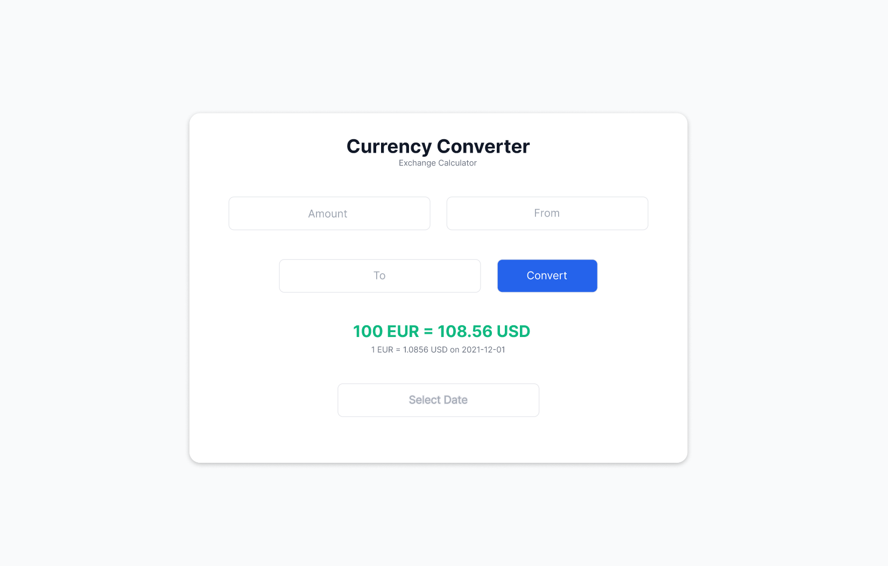

# 💱 Currency Converter

A responsive web app that converts between global currencies and shows historical exchange rates.  
Built as part of the **ALX Frontend Engineering Capstone Project** using **React**, **Tailwind CSS**, and the **Frankfurter API**.

---

## 🖼️ Preview
  

---

## ✨ Features
- Real-time currency conversion  
- View historical exchange rates  
- Responsive design (mobile & desktop)  
- Simple, intuitive interface  
- Data fetched from [Frankfurter API](https://www.frankfurter.app/)

---

## 🧰 Tech Stack
- **React (Vite)**
- **Tailwind CSS**
- **JavaScript (ES6+)**
- **Frankfurter API**
- **Figma** (Design)
- **Netlify** (Deployment)
