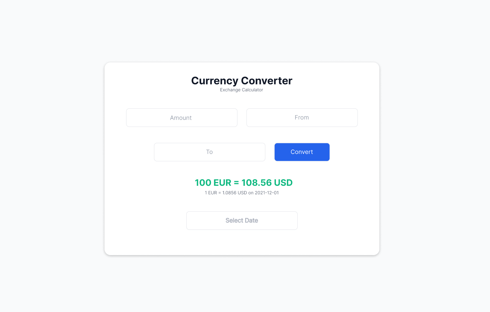

# Currency Converter

A responsive web app that converts between global currencies using live exchange rates.  
Built as part of the **ALX Frontend Engineering Capstone Project** using **React**, **Tailwind CSS**, and the **ExchangeRate API**.

---

## Preview
  

---

## Features
- Real-time currency conversion    
- Responsive design (mobile & desktop)  
- Simple, intuitive interface  
- Data fetched from [ExchangeRate API](https://app.exchangerate-api.com/)

---

## Tech Stack
- **React (Vite)**
- **Tailwind CSS**
- **JavaScript (ES6+)**
- **ExchangeRate API**
- **Figma** (Design)
- **Netlify** (Deployment)

## Future Improvements
- Display historical trends with charts
- Add light/dark mode toggle
- Enhance accessibility and mobile UX
- Include multi-language support